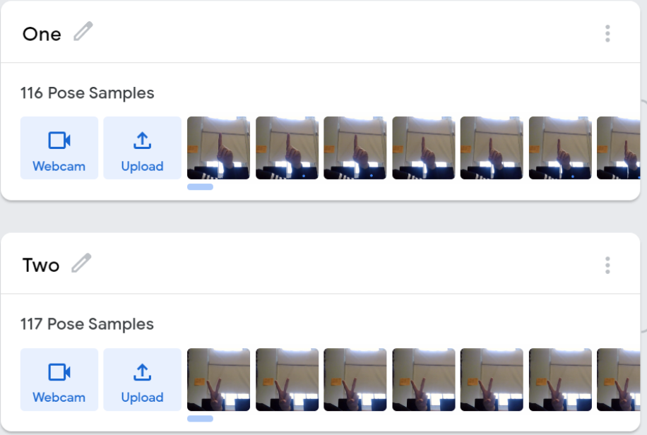
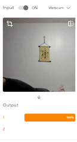

# Entry 2
##### 12/19/21

Previously after selecting my tool to learn, I have been following along the tutorial on their website and start 'machine training' aka the google's [teachable machine](https://teachablemachine.withgoogle.com/). I first started off with Ml5's starter code

```
<!DOCTYPE html>
<html>
<head>
    <meta charset='utf-8'>
    <meta http-equiv='X-UA-Compatible' content='IE=edge'>
    <title>ML5 Test</title>
    <meta name='viewport' content='width=device-width, initial-scale=1'>
    <link rel='stylesheet' type='text/css' media='screen' href='main.css'>
    <script src='main.js'></script>
</head>
<body>
    <div>Teachable Machine Image Model</div>
<button type="button" onclick="init()">Start</button>
<div id="webcam-container"></div>
<div id="label-container"></div>
<script src="https://cdn.jsdelivr.net/npm/@tensorflow/tfjs@1.3.1/dist/tf.min.js"></script>
<script src="https://cdn.jsdelivr.net/npm/@teachablemachine/image@0.8/dist/teachablemachine-image.min.js"></script>
</body>
</html>
```
The following code above imports material from google's learnable machine. In this code it exports the learning data set that I have been 'training' it for. The training process is rather simple, the larger the sample the more accurate it is. Since there are no data set for the American Sign Language(ASL) that looked the way I wanted to look, I started gathering the data.



Here, I am gathering some samples for the sign language. I first start training the machine to idenitify numbers 1-10. This the preview of how it is suppose to work when I implement it in my project in the future.



Although this is working as needed, I am faced with a challenging/confusion of importing the dataset back into the javascript folder. There was not a lot of information about ml5 besides their website and in depth explanation of how ml5 works, so I started looking into the alternative of [TensorFlow](https://www.tensorflow.org/js/tutorials). Apparently ml5 was based of tensorflow, so I imported the tensorflow starter code and from there, I started experimenting. My current engineering process is brainstorming possible solutions to implement ml5 into my project on html, css, and javascript. My next step would be using the data I collected and start coding with the assistant of the internet.

One of the skills that is coming in really handy is how-to-google again, since there are limited resources, I need to really search for content in the way that is really efficent to get the materials I need. In this case, I need to dig deeper.


[Previous](entry01.md) | [Next](entry03.md)

[Home](../README.md)