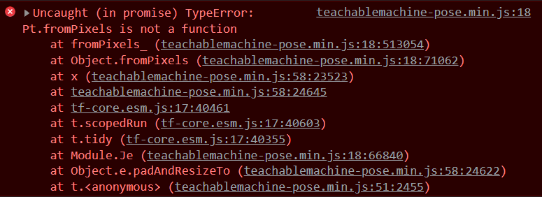

# Entry 3
##### 2/13/22

Welcome back! On today's entry, I will give some updates about what I have been doing! Previously, I trained a machine model with series of photo datasets. I downloaded with TensorFlow.js and extracted files to begin coding.


Initially, I had trouble importing the JSON file, I was struggling to access the file while attempting to code in a Javascript file. I first tried to use the parse method

`var mydata = JSON.parse(data);`

While attempting to make this code run with a code test, I came across an error that was an invalid data type. Although I was confused at first, I quickly found out that the code isnt loading a json file. It is actually just loading another javascript file which stores some hardcoded json as a variable named data. After understanding the reason behind the error, I went ahead and tried another way to access JSON file-- the asynchrous function.

In the past, I have tried to understand [asynchrous functions](https://developer.mozilla.org/en-US/docs/Web/JavaScript/Reference/Statements/async_function). But I was left dumbfounded. However, I tried again this time and understood that asychronous function is kind of a like a delayed function. It will not perform until the function is `fulfiled` or `rejected`. After some researching, I begin typing my code.

```
let data;
fetch("example.json").then(async(res) => {
    data = await res.json();
   // data = await res.text();
    console.log(data.book);
})

```

In this code snippet, I learned a two things:
1. The arrow function - short handed way of writing function
2. `.json()` function - converts the data types depending on what the programmer wants. To explore my curiousity, I used the `.text()` function to see what happens and it turns out to print out example.json's data in plain text.

One I got overcame that issue, I begin getting into the good part-- beginning to code. To get the interface of camera identification working, I first tested out my code. Although the interface of a start button appeared, I got an error about [promises](https://developer.mozilla.org/en-US/docs/Web/JavaScript/Reference/Global_Objects/Promise):



As of right now, I am still trying to figure out this error. But as time goes on, I am sure I will find the solution.

<hr>

Since the last time, I have learned the skill of googling a lot more efficently. With the most recent update, I will be developing my skill of Problem decomposition. Right now, the error seems to be very overwhemling for me with a bunch of code, I will need to narrow down the code ereror step by step.

My next steps for Engineering Design Process is to brainstorm. As I am reading for code errors, I want to brainstorm differents ideas on how to effficently debug code.


[Previous](entry02.md) | [Next](entry04.md)

[Home](../README.md)