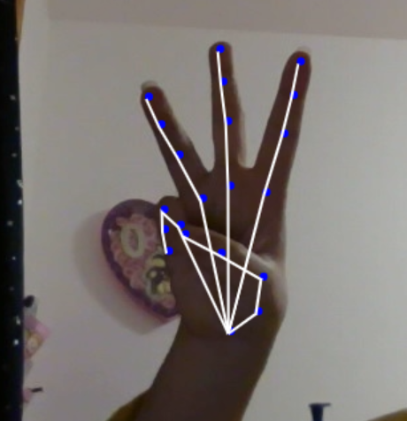

# Entry 4
##### 3/21/22

## Welcome back!

You have made it to the fourth blog...things are getting a bit more serious now as I get closer to the deadline in April. Previously, there was an error on my code from the ML5.js starter code. The error seems to be unknown as I tried to debug. While trying to debug though however, I was not able to find the error since I added some of my own code into the program without pushing it to github. Which...ended up messing up the debugging process for me more since I do not know if the error was from the original template or if it happened after I added in my lines of code. With the advice of our instructor, Mr.Muller, he adviced me to restart from scratch and see if the code was broken before I added my line of code or afterwards.

...Although that was the first thing I tried, I was still not able to understand the same error that it gave me. Which means that this was an error from the template code. Searching for an alternative `ML5.js` code template was a bit of a challenge since there was not a lot of resources out there. Knowing that `ml5.js` is the simplified version of `Tensorflow.js`, I decided to restart the whole entire process with [TensorFlow.js](https://www.tensorflow.org/js/tutorials/setup) instead.

### Process

I first started off by looking at some demos given for the website. And I realize that tensorFlow was better despite not being simplified like ML5. Tensorflow allows users to only detect handsigns with the ability to recoginze inidivual fingers like this:

 

I am currently in my engineering process of planning the next steps. Althought I was moving onto my next stage, some errors allowed me to realize there is a better way to create the things that I want. With my planning process, I plan to start learning some factors of pose machine learning:


Learning that there is already a pre-set for each part of our hands allowed me to start following some code:

```javascript
const model = handPoseDetection.SupportedModels.MediaPipeHands;
const detectorConfig = {
  runtime: 'mediapipe', // or 'tfjs',
  solutionPath: 'https://cdn.jsdelivr.net/npm/@mediapipe/hands',
  modelType: 'full'
}
const detector = await handPoseDetection.createDetector(model, detectorConfig);

```
The code above allowed me to use the pre-set hand movements into my browser.

With that set up, this line of code will allow me to detect hands:

```javascript
const hands = await detector.estimateHands(image);

```
Right now, I am gaining major solving problem skills. I thought about alternative ways that I can potentially solve my issue and not be stuck on one thing. Although it feels like I wasted a bit of time, learning javascript's async functions did not disappoint me.

My next steps is to [import](https://github.com/tensorflow/tfjs-models/tree/master/hand-pose-detection/src/mediapipe) my data set which is already in tensorFlow.js format into the program. Which might take some configuration but I know that I will be able to do it.

[Previous](entry03.md) | [Next](entry05.md)

[Home](../README.md)